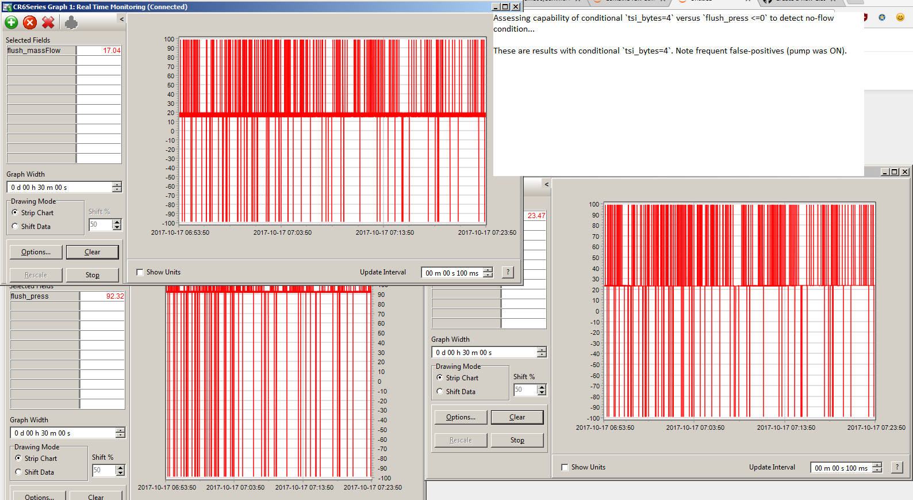
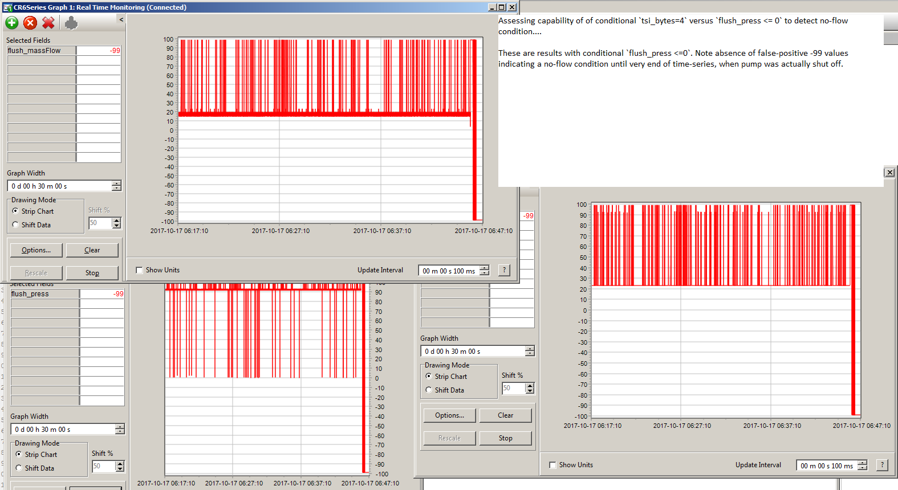

## Model 4040/4043/4045 Thermal Mass Flowmeter

For very fast (e.g. 10Hz) data acquisition, binary communication is suggested.

### Binary serial comms

The following programs demonstrate querying a TSI model 4043 flowmeter for
data in binary format:

* [`tsi4043_binary.cr3`](tsi4043_binary.cr3) *(original code)*
* [`tsi4043_binary.cr6`](tsi4043_binary.cr6) *(adapted)*

#### Known issues / TO DO

> The CR3000 code hasn't been revised with new error handling code yet.

Record parsing isn't very reliable because of the choice of `SerialInRecord` and
the fact the delimiter is a valid data value... suggested improvements:

* check for case of 5 bytes returned by SerialInRecord and instead of throwing
  out record, just load bytes into Longs in alternate way
* or, instead, switch to `SerialInBlock` and adapt parsing to throw away delims

#### Design notes

> Original notes available in PROPHET 2014 FIS DAQ write-up.

Because `SerialInRecord` looks for a leading null byte (`0x00`) to delimit data
records, if the flow is zero (0.00) then that data word is effectively discarded.
To avoid temperature and pressure data being incorrectly loaded into corresponding
flow and temperature positions, check to ensure the absolute pressure is never
zero.

